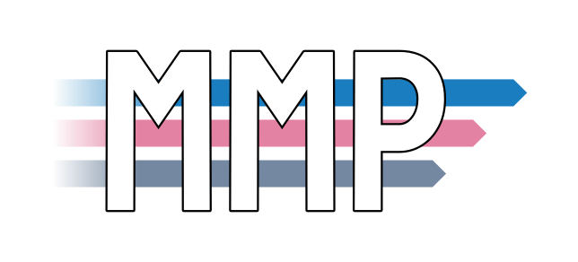

# mmp-go



Mega Multiplexer, port mutiplexer for shadowsocks, supports AEAD methods only.

### Intro

You can use mmp-go to reuse single port to forward to multiple shadowsocks servers.

It is suitable for relay servers with a limited number of ports.

Consider the following:

> \- 草，这破 NAT 🐔怎么就俩端口？<br/>
> \- mmp，go！<br/>

```bash
                                                   |------> SS Server1
Client --> Single Port --> Validator / Multiplexer |------> SS Server2
                                                   |------> SS Server3
```

### Usage

```shell
./mmp-go -conf example.json
```

Refer to `example.json`

### AEAD methods supported

- chacha20-ietf-poly1305 (chacha20-poly1305)
- aes-256-gcm
- aes-128-gcm

### Related Projects

- [Qv2ray/mmp-rs](https://github.com/Qv2ray/mmp-rs) A rust-lang implementation of Mega Multiplexer.
- [mzz2017/outline-watch-dog](https://github.com/mzz2017/outline-watch-dog) Watch and keep read privilege for `/opt/outline` recursively to avoid permission denied.

### Special Thanks:

- Qv2ray Developer Community
